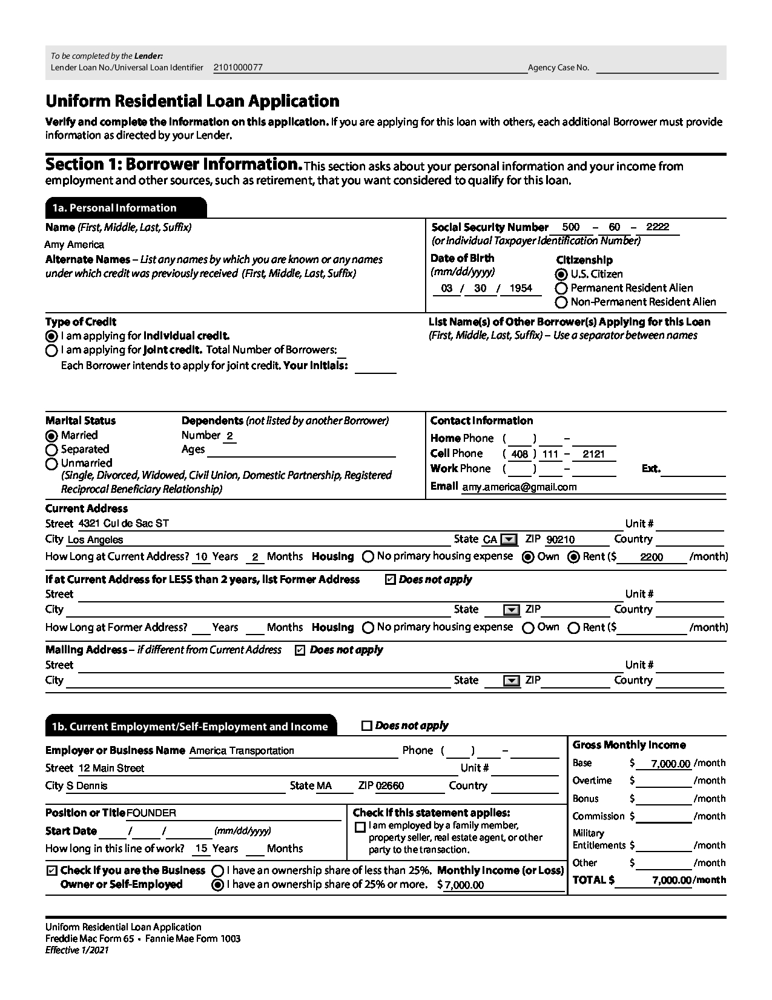

# PDF Checkbox and Radiobutton Processing with LLMWhisperer
This is a demonstration and companion repo that shows how to process PDF form elements like checkboxes and radiobuttons with [LLMWhisperer](https://unstract.com/llmwhisperer/), which is a text extraction service that specifically targets large language models (LLMs).

PDF forms have checkboxes and radiobuttons that can be filled out by the user. These form elements are used to collect data from the user. In this repo, we will show how to extract these form elements using LLMWhisperer in a way that LLMs can understand.

LLMWhisperer can both recognize checkboxes and radiobuttons and also render them in the extracted text in a manner that LLMs can understand. This allows you to use an LLM to process forms in PDFs.

## How this works
We'll call the LLMWhisperer API to extract text from a PDF form that contains checkboxes and radiobuttons. The extracted text will contain the form elements and their values rendered in a way LLMs can comprehend. We'll then parse this text to extract the values of the checkboxes and radiobuttons using Langchain in combination with Pydantic, finally generating structured JSON output. We'll use OpenAI's GPT-3 as the LLM in this example.

## Supported operating systems
You should be able to run this on Linux or on a Mac. Windows is not supported, although one should be able to make it run there with minor changes.

## Keys you'll need
You'll need keys for OpenAI and [LLMWhisperer](https://unstract.com/llmwhisperer/), which you can get for free. Please read the blog post for more information. Once you have the keys, please add them to the `.env` file in the root of the project.

## Running the code
Clone this repo and change to the `llmwhisperer-pdf-checkbox-processing` directory. We suggest you run the code after you've created a Python virtual environment. You can create a virtual environment by running the following command:

```bash
python3 -m venv .venv
```

Next, activate the virtual environment:

```bash
source .venv/bin/activate
```

Now, install the dependencies:

```bash
pip install -r requirements.txt
```

Next, copy the `sample.env` file to `.env`, edit the `.env` file to add your OpenAI and LLMWhisperer keys:

```bash
cp sample.env .env
```

Finally, run the code:
    
```bash
python main.py 
```


## PDF form we'll be extracting data from
We will be using the following PDF form to demonstrate how to process checkboxes and radiobuttons with LLMWhisperer:



## How the extracted text from LLMWhisperer looks like
```plaintext
  To be completed by the Lender: 
 Lender Loan No./Universal Loan Identifier 2101000077                                           Agency Case No. 

Uniform Residential Loan Application 
Verify and complete the information on this application. If you are applying for this loan with others, each additional Borrower must provide 
information as directed by your Lender. 

Section 1: Borrower Information. This section asks about your personal information and your income from 
employment and other sources, such as retirement, that you want considered to qualify for this loan. 

  1a. Personal Information 
Name (First, Middle, Last, Suffix)                                           Social Security Number    500   - 60       2222 
Amy America                                                                  (or Individual Taxpayer Identification Number) 
Alternate Names - List any names by which you are known or any names         Date of Birth            Citizenship 
under which credit was previously received (First, Middle, Last, Suffix)    (mm/dd/yyyy)             [X] U.S. Citizen 
                                                                               03    30      1954    [ ] Permanent Resident Alien 
                                                                                                     [ ] Non-Permanent Resident Alien 
Type of Credit                                                              List Name(s) of Other Borrower(s) Applying for this Loan 
[X] I am applying for individual credit.                                    (First, Middle, Last, Suffix) - Use a separator between names 
[ ] )I am applying for joint credit. Total Number of Borrowers: 
    Each Borrower intends to apply for joint credit. Your initials: 

Marital Status             Dependents (not listed by another Borrower)       Contact Information 
[X] Married                Number 2                                         Home Phone (         1 
[ ] Separated               Ages                                             Cell Phone    ( 408 ) 111 -   2121 
[ ] Unmarried                                                                Work Phone    (     )                     Ext. 
    (Single, Divorced, Widowed, Civil Union, Domestic Partnership, Registered 
    Reciprocal Beneficiary Relationship)                                     Email amy.america@gmail.com 
Current Address 
Street 4321 Cul de Sac ST                                                                                          Unit # 
City Los Angeles                                                                  State CA [X] ZIP 90210         Country 
How Long at Current Address? 10 Years    2 Months Housing [ ] No primary housing expense [X] Own [X] Rent ($          2200      /month) 

If at Current Address for LESS than 2 years, list Former Address    [X] Does not apply 
Street                                                                                                             Unit # 
City                                                                             State     [X] ZIP               Country 
How Long at Former Address?       Years     Months Housing [ ] )No primary housing expense [ ] Own [ ] Rent ($                  /month) 

Mailing Address - if different from Current Address [X] Does not apply 
Street                                                                                                             Unit # 
City                                                                             State     [X] ZIP               Country 

  1b. Current Employment/Self-Employment and Income            [ ] Does not apply 
                                                                                                         Gross Monthly Income 
Employer or Business Name America Transportation                       Phone (             - 
                                                                                   Unit #                Base       $    7,000.00 /month 
Street 12 Main Street 
                                                                                                         Overtime   $            /month 
City S Dennis                                    State MA      ZIP 02660        Country 
                                                                                                         Bonus      $            /month 
Position or Title FOUNDER                                    Check if this statement applies:            Commission $            /month 
                                                              [ ] I am employed by a family member, 
Start Date       1      /         (mm/dd/yyyy) 
                                                                property seller, real estate agent, or other Military 
                                                                                                         Entitlements $          /month 
How long in this line of work? 15 Years     Months              party to the transaction. 
                                                                                                         Other      $            /month 
 [X] Check if you are the Business [ ] I have an ownership share of less than 25%. Monthly Income (or Loss) 
                                                                                                         TOTAL $         7,000.00/month 
   Owner or Self-Employed        [X] I have an ownership share of 25% or more. $ 7,000.00 

Uniform Residential Loan Application 
Freddie Mac Form 65 . Fannie Mae Form 1003 
<<<
```

## Final output JSON
```json
{
    "personal_details": {
        "name": "Amy America",
        "ssn": "500-60-2222",
        "dob": "1954-03-30T00:00:00Z",
        "citizenship": "U.S. Citizen"
    },
    "extra_details": {
        "type_of_credit": "Individual",
        "marital_status": "Married",
        "cell_phone": "(408) 111-2121"
    },
    "current_address": {
        "street": "4321 Cul de Sac ST",
        "city": "Los Angeles",
        "state": "CA",
        "zip_code": "90210",
        "residing_in_addr_since_years": 10,
        "residing_in_addr_since_months": 2,
        "own_house": true,
        "rented_house": true,
        "rent": 2200,
        "mailing_address_different": false
    },
    "employment_details": {
        "business_owner_or_self_employed": true,
        "ownership_of_25_pct_or_more": true
    }
}
```